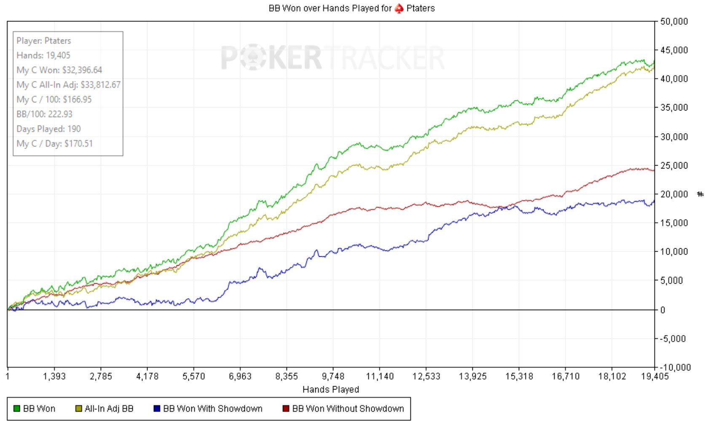

# ClubWPT Gold Hand History Scraper

Scrapes NLHE cash game hand analysis data from ClubWPT Gold and converts it to PokerStars hand history text or [Open Hand History](https://hh-specs.handhistory.org) (OHH) JSON, for import into PokerTracker 4 or Holdem Manager 3.



## Setup

Requires Python 3.12+ and [uv](https://docs.astral.sh/uv/).

```bash
cd clubwpt-scraper
uv sync
```

## Getting Your Auth Token

The scraper needs a JWT token from the ClubWPT Gold hand analysis site. Here's how to get it:

1. Open **Chrome** (or any Chromium-based browser) and log in to [ClubWPT Gold](https://www.clubwpt.com/).

2. Navigate to the **Hand Analysis** page. It will load the Quintace analysis interface.

3. Open **Developer Tools** (`F12` or `Ctrl+Shift+I` on Linux/Windows, `Cmd+Option+I` on Mac).

4. Go to the **Network** tab.

5. In the filter bar, type `hands` to narrow down the requests.

6. Reload the page or click through the hand history interface so that an API request fires.

7. Find a request to `analysis-b2b.quintace.ai/api/players/hands` in the list and click on it.

8. In the **Headers** panel, scroll down to **Request Headers** and find the `x-a5-authorization` header.

9. Copy the entire value (it starts with `eyJ...`). This is your JWT token.

The token is valid for several months (check the `exp` claim in a JWT decoder if needed).

## Usage

### Full Pipeline (Scrape + Convert)

```bash
uv run python main.py --token "eyJ..."
```

### Scrape Only

Save raw JSON from the API without converting:

```bash
uv run python main.py --token "eyJ..." --scrape-only
```

### Convert Only

Re-convert previously scraped raw JSON (no token needed):

```bash
uv run python main.py --convert-only
```

### Incremental Update

Fetch only new hands since the last scrape (stops on the first duplicate):

```bash
uv run python main.py --token "eyJ..." --update
```

### Refresh Recent Pages

Re-fetch pages that may contain hands from the last 3 days (handles page shifting from new hands), then use the cache for older pages:

```bash
uv run python main.py --token "eyJ..." --refresh-recent
```

### Full Re-download

Ignore the on-disk cache entirely and re-download every page:

```bash
uv run python main.py --token "eyJ..." --overwrite
```

### Output Format

ClubWPT Gold games have antes and a mandatory UTG straddle, neither of which the PokerStars text format can express. `--format ohh` writes Open Hand History JSON instead, which models both natively:

```bash
uv run python main.py --token "eyJ..." --format ohh
uv run python main.py --token "eyJ..." --format both   # write both formats
```

| | `pokerstars` (default) | `ohh` |
|---|---|---|
| Antes | `posts the ante` lines | `Post Ante` actions |
| Straddle | faked as a preflop raise from UTG | `Straddle` action |
| Post-to-enter | understated as a big blind, because PT4 reads a larger post as partly dead | `Post Extra Blind` for the real amount |
| Amounts won | split across winners in proportion to their net | each winner's exact take, so side pots stay correct |

Both formats are built from the same reconstruction of the hand, so they agree on antes, blinds, and which players were charged a post. The remaining differences are the ones the PokerStars text format cannot express.

Accuracy against the API's own figures, over a 61,726-hand corpus:

- **`ohh`** — every player's net reconciles except 6 hands whose split-pot odd chip lands on a different seat (1–2 cents each).
- **`pokerstars`** — the same, except in the 1,595 hands where someone posted to enter: PT4 forces the post to be written as a big blind, so each poster's contribution is one big blind light.

### Options

| Flag | Default | Description |
|------|---------|-------------|
| `--token` | *(required unless `--convert-only`)* | JWT from `x-a5-authorization` header |
| `--output-dir` | `./output` | Base output directory |
| `--page-size` | `100` | Hands per API page |
| `--start-page` | `1` | First page to scrape |
| `--end-page` | all | Last page to scrape |
| `--max-concurrent` | `10` | Max concurrent API requests |
| `--format` | `pokerstars` | Output format: `pokerstars`, `ohh`, or `both` |
| `--hero-uid` | auto-detected | Your player UID (for "Dealt to" lines); auto-detected from `table.session_id` if omitted |
| `--scrape-only` | | Only scrape, don't convert |
| `--convert-only` | | Only convert existing raw data |
| `--update` | | Incremental scrape: fetch new hands, stop on first duplicate |
| `--refresh-recent` | | Bypass cache for pages within the last 3 days |
| `--overwrite` | | Re-download every page, ignoring cache |

## Output

```
output/
  raw/              # Raw JSON pages (page_00001.json ... page_00547.json)
  pokerstars/       # PokerStars format files (HH_2026-07-17.txt, ...)
  ohh/              # Open Hand History files (HH_2026-07-17.ohh, ...)  [--format ohh]
```

Either directory can be imported into PokerTracker 4 or Holdem Manager 3 via their hand history import feature. Import one or the other, not both — the same hands in two formats will double-count.

An `.ohh` file is a run of JSON objects separated by a blank line (not one enclosing array), per the OHH storage format. To read one hand:

```bash
head -1 output/ohh/HH_2026-07-17.ohh | python -m json.tool
```

## Running Tests

```bash
uv run pytest -v
```
